# GantChart - プロジェクト管理システム

Backlog に類似したプロジェクト管理アプリケーション。ガントチャート機能を中心に、プロジェクト/課題管理、タスク依存関係、マイルストーン、ユーザーアサイン、開発者向けツール群を備える。

## スクリーンショット

### ガントチャート

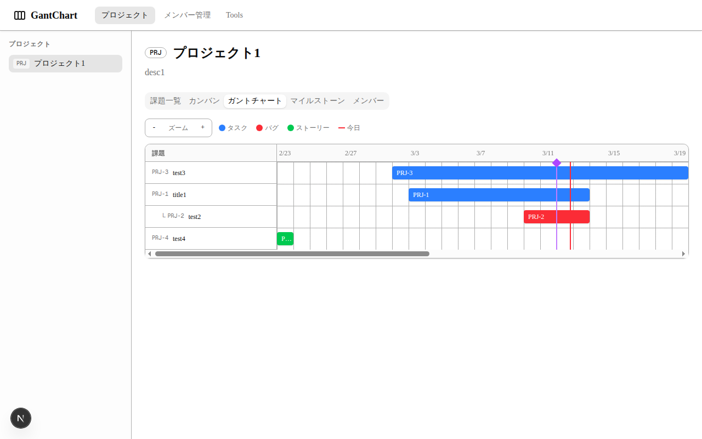

### 開発者ツール一覧

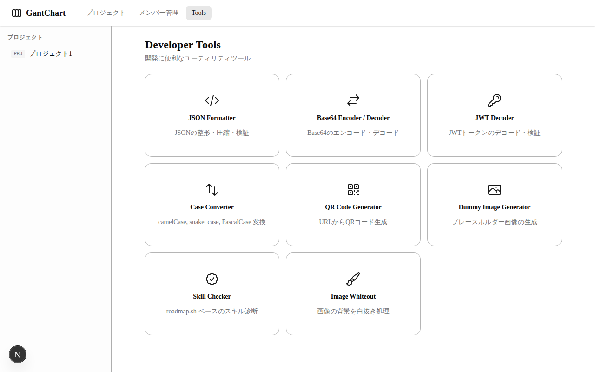

### スキルチェッカー

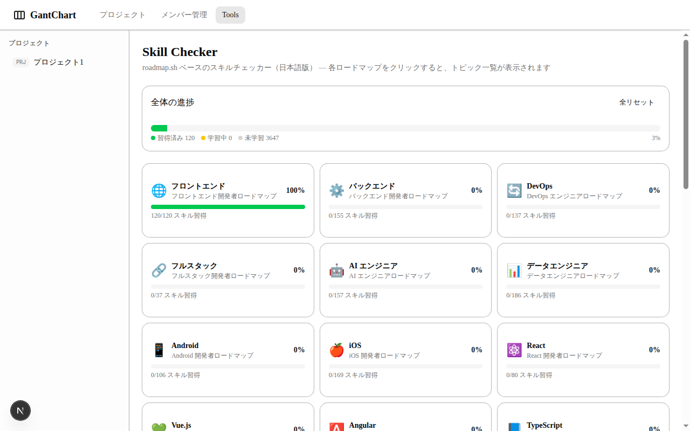

### スキルチェッカー詳細

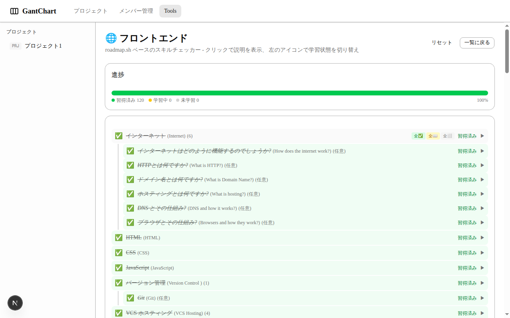

### JSON Formatter

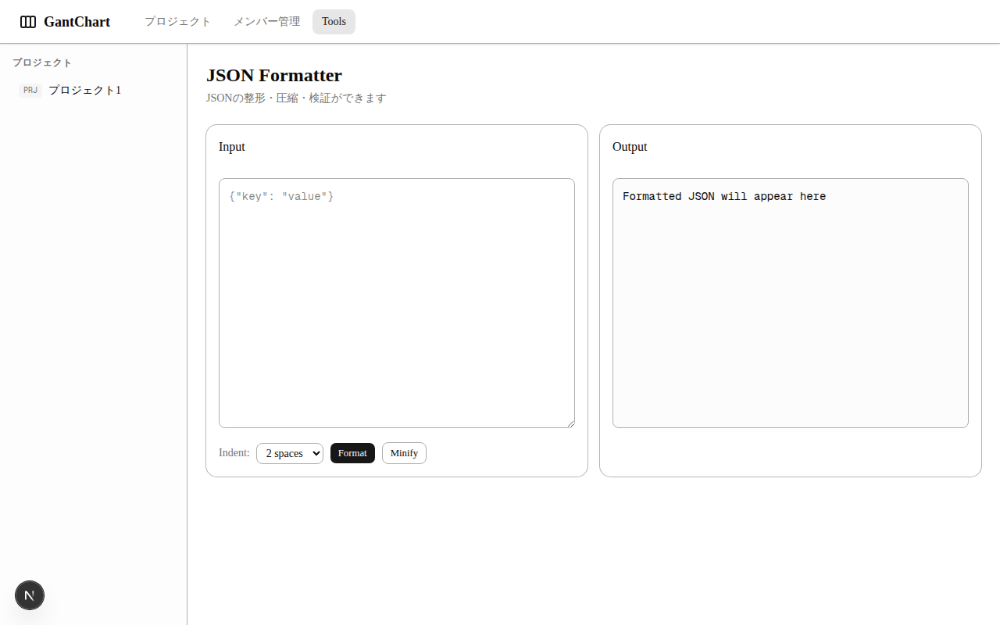

### Base64 Encoder / Decoder

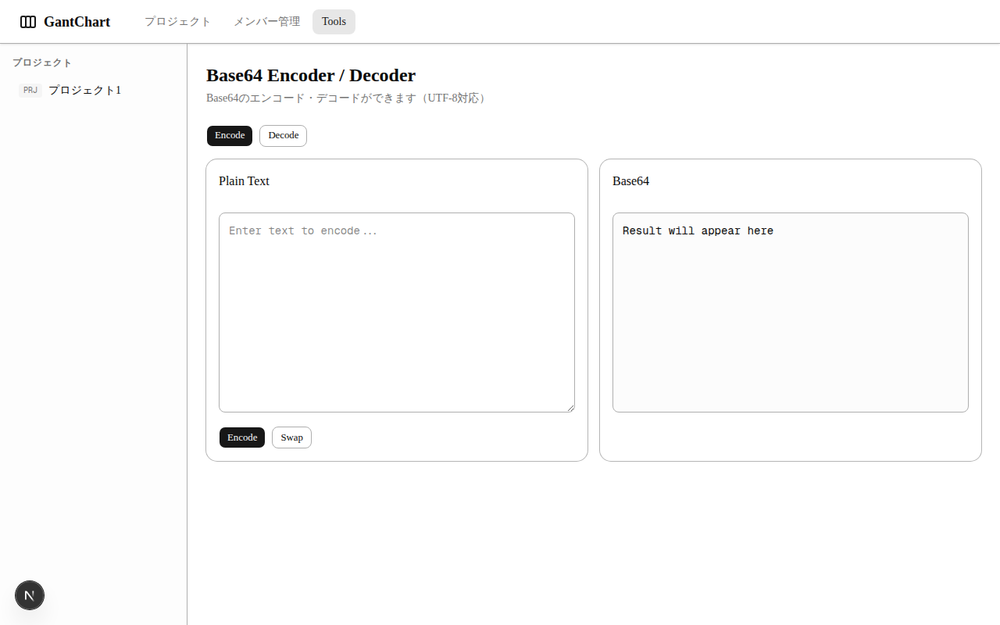

### JWT Decoder

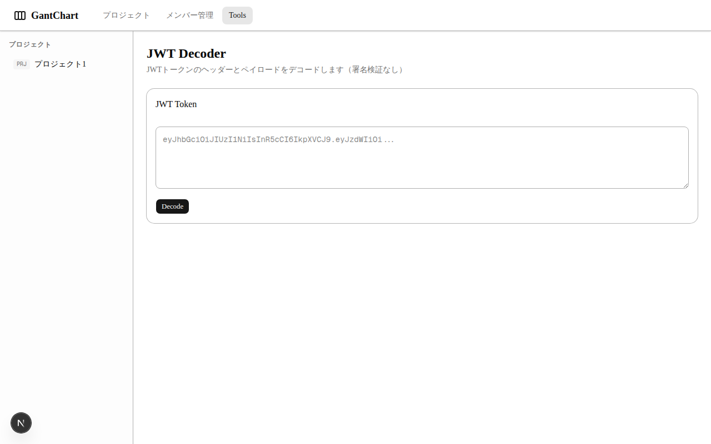

### Case Converter

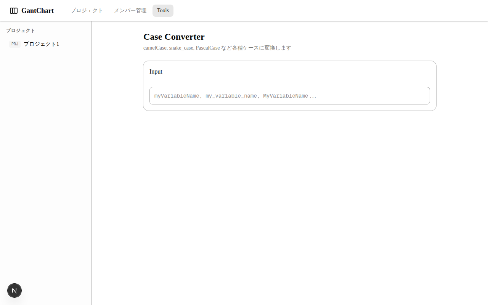

### QR Code Generator

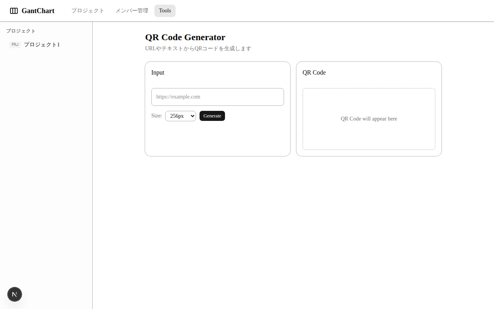

### Dummy Image Generator

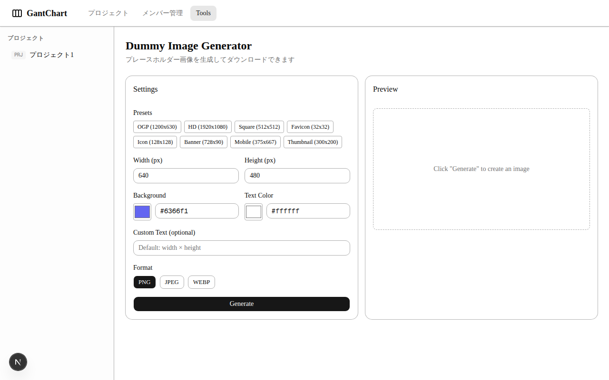

### Image Whiteout

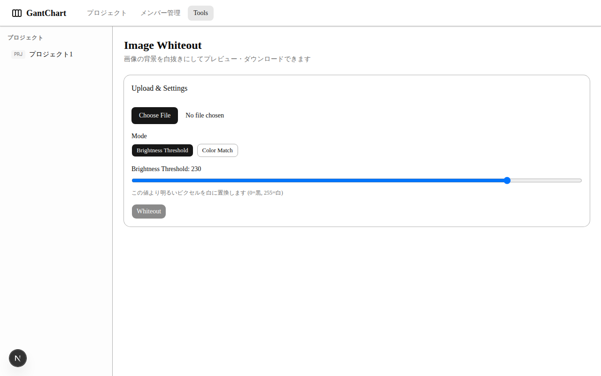

## 技術スタック

| レイヤー | 技術 | バージョン |
| -------- | ---- | ---------- |
| フロントエンド | Next.js (App Router) | 16.1.6 |
| フロントエンド | React | 19.2.3 |
| フロントエンド | TypeScript | 5 |
| フロントエンド | Tailwind CSS | 4 |
| フロントエンド | TanStack React Query | 5.90.21 |
| フロントエンド | Zod | 4.3.6 |
| フロントエンド | Shadcn UI / Radix UI | 最新 |
| フロントエンド | Vitest + Testing Library | 4.0.18 |
| バックエンド | FastAPI | 0.115.0+ |
| バックエンド | Python | 3.12+ |
| バックエンド | SQLAlchemy (async) | 2.0+ |
| バックエンド | Pydantic | 2.0+ |
| バックエンド | Alembic | 1.13.0+ |
| バックエンド | pytest + httpx | 8.0+ |
| データベース | PostgreSQL | 16 |
| ビルドツール | Bun | 1.x |
| インフラ | Docker Compose | - |
| デプロイ (FE) | Vercel | - |
| デプロイ (BE) | Fly.io | - |

## クイックスタート

### 前提条件

- Docker および Docker Compose
- Bun（フロントエンドビルドツール）
- Python 3.12+（バックエンド）

### Docker Compose（推奨）

```bash
# 1. 環境変数ファイルをコピー
cp .env.example .env

# 2. 全サービスを起動
docker compose up

# フロントエンド: http://localhost:3000
# バックエンド:   http://localhost:8000
# API ドキュメント: http://localhost:8000/docs
```

### 手動セットアップ

#### バックエンド

```bash
cd backend

# 仮想環境の作成
python -m venv .venv
source .venv/bin/activate

# 依存関係のインストール
pip install -r requirements.txt

# マイグレーション実行（PostgreSQL が起動している必要あり）
alembic upgrade head

# サーバー起動
uvicorn app.main:app --reload --port 8000
```

#### フロントエンド

```bash
cd frontend

# 依存関係のインストール
bun install

# 開発サーバーの起動
bun run dev
```

## 環境変数

<!-- AUTO-GENERATED:ENV_TABLE -->

| 変数名 | 必須 | スコープ | 説明 | デフォルト値 |
| ------ | ---- | -------- | ---- | ----------- |
| `POSTGRES_USER` | はい | Docker | PostgreSQL ユーザー名 | `gantchart` |
| `POSTGRES_PASSWORD` | はい | Docker | PostgreSQL パスワード | `gantchart_dev` |
| `POSTGRES_DB` | はい | Docker | PostgreSQL データベース名 | `gantchart` |
| `DATABASE_URL` | はい | バックエンド | 非同期 PostgreSQL 接続文字列 | `postgresql+asyncpg://gantchart:gantchart_dev@db:5432/gantchart` |
| `CORS_ORIGINS` | はい | バックエンド | カンマ区切りの許可オリジン | `http://localhost:3000` |
| `BACKEND_HOST` | いいえ | バックエンド | サーバーバインドホスト | `0.0.0.0` |
| `BACKEND_PORT` | いいえ | バックエンド | サーバーバインドポート | `8000` |
| `API_KEY` | いいえ | バックエンド | API 認証キー | （空） |
| `RATE_LIMIT` | いいえ | バックエンド | レートリミット設定 | `60/minute` |
| `NEXT_PUBLIC_API_URL` | はい | フロントエンド | バックエンド API のベース URL | `http://localhost:8000` |

<!-- AUTO-GENERATED:ENV_TABLE -->

環境の切り替え：

- **開発環境**: `backend/.env` + `frontend/.env.local`
- **本番環境**: `backend/.env.production` + `frontend/.env.production`

## 利用可能なコマンド

### フロントエンドコマンド

<!-- AUTO-GENERATED:FE_SCRIPTS -->

| コマンド | 説明 |
| -------- | ---- |
| `bun run dev` | ホットリロード付き開発サーバーの起動 |
| `bun run build` | 型チェック付き本番ビルド |
| `bun run start` | 本番サーバーの起動 |
| `bun run lint` | ESLint の実行 |
| `bun run typecheck` | TypeScript 型チェックの実行 |
| `bun run test` | ウォッチモードでテスト実行（Vitest） |
| `bun run test:run` | テストを1回実行 |
| `bun run test:coverage` | カバレッジレポート付きテスト実行 |

<!-- AUTO-GENERATED:FE_SCRIPTS -->

### バックエンドコマンド

<!-- AUTO-GENERATED:BE_SCRIPTS -->

| コマンド | 説明 |
| -------- | ---- |
| `uvicorn app.main:app --reload` | 開発サーバーの起動 |
| `pytest tests/ -v` | 全テストの詳細実行 |
| `pytest --cov=app tests/` | カバレッジレポート付きテスト実行 |
| `alembic revision --autogenerate -m "message"` | 新規マイグレーション作成 |
| `alembic upgrade head` | 全マイグレーションの適用 |
| `alembic downgrade -1` | 直前のマイグレーションにロールバック |

<!-- AUTO-GENERATED:BE_SCRIPTS -->

## API エンドポイント

<!-- AUTO-GENERATED:API_ENDPOINTS -->

### ヘルスチェック

| メソッド | パス | 説明 |
| -------- | ---- | ---- |
| `GET` | `/health` | ヘルスチェック |

### ユーザー `/users`

| メソッド | パス | 説明 |
| -------- | ---- | ---- |
| `GET` | `/users` | ユーザー一覧取得（`?include_archived=true` でアーカイブ済みも含む） |
| `POST` | `/users` | ユーザー作成（`name_kana` にカタカナバリデーション） |
| `GET` | `/users/{user_id}` | ユーザー取得 |
| `PATCH` | `/users/{user_id}` | ユーザー更新 |
| `DELETE` | `/users/{user_id}` | ユーザー削除 |
| `POST` | `/users/{user_id}/archive` | ユーザーアーカイブ |
| `POST` | `/users/{user_id}/unarchive` | ユーザーアーカイブ解除 |
| `POST` | `/users/bulk-delete` | ユーザー一括削除（最大100件、body: `{ids: [...]}`) |
| `POST` | `/users/bulk-archive` | ユーザー一括アーカイブ（最大100件、body: `{ids: [...]}`) |

### スキルプログレス `/users/{user_id}/skill-progress`

| メソッド | パス | 説明 |
| -------- | ---- | ---- |
| `GET` | `/users/{user_id}/skill-progress` | スキル進捗取得（`?roadmap_slug=` でフィルタ可） |
| `PUT` | `/users/{user_id}/skill-progress` | スキル進捗の一括更新（upsert） |
| `DELETE` | `/users/{user_id}/skill-progress` | スキル進捗の削除（`?roadmap_slug=` でフィルタ可） |

### プロジェクト `/projects`

| メソッド | パス | 説明 |
| -------- | ---- | ---- |
| `GET` | `/projects` | プロジェクト一覧取得 |
| `POST` | `/projects` | プロジェクト作成 |
| `GET` | `/projects/{project_id}` | メンバー付きプロジェクト取得 |
| `PATCH` | `/projects/{project_id}` | プロジェクト更新 |
| `DELETE` | `/projects/{project_id}` | プロジェクト削除（カスケード） |
| `POST` | `/projects/{project_id}/archive` | プロジェクトアーカイブ（課題にカスケード） |
| `POST` | `/projects/{project_id}/unarchive` | プロジェクトアーカイブ解除（課題にカスケード） |
| `POST` | `/projects/bulk-delete` | プロジェクト一括削除（最大100件、body: `{ids: [...]}`) |
| `POST` | `/projects/bulk-archive` | プロジェクト一括アーカイブ（最大100件、body: `{ids: [...]}`) |

### プロジェクトメンバー

| メソッド | パス | 説明 |
| -------- | ---- | ---- |
| `GET` | `/projects/{project_id}/members` | プロジェクトメンバー一覧 |
| `POST` | `/projects/{project_id}/members` | メンバー追加 |
| `DELETE` | `/projects/{project_id}/members/{user_id}` | メンバー削除 |
| `POST` | `/projects/{project_id}/members/{user_id}/archive` | メンバーアーカイブ |
| `POST` | `/projects/{project_id}/members/{user_id}/unarchive` | メンバーアーカイブ解除 |
| `POST` | `/projects/{project_id}/members/bulk-delete` | メンバー一括削除（最大100件） |
| `POST` | `/projects/{project_id}/members/bulk-archive` | メンバー一括アーカイブ（最大100件） |

### 課題

| メソッド | パス | 説明 |
| -------- | ---- | ---- |
| `GET` | `/projects/{project_id}/issues` | 課題一覧（ステータス、優先度、担当者、マイルストーンでフィルタ可） |
| `POST` | `/projects/{project_id}/issues` | 課題作成（issue_key 自動生成、`parent_id` 対応） |
| `PATCH` | `/projects/{project_id}/issues/bulk` | 課題一括更新（ガントチャートドラッグ用） |
| `POST` | `/projects/{project_id}/issues/bulk-delete` | 課題一括削除（最大100件、body: `{ids: [...]}`) |
| `POST` | `/projects/{project_id}/issues/bulk-archive` | 課題一括アーカイブ（最大100件、body: `{ids: [...]}`) |
| `GET` | `/issues/{issue_id}` | 課題詳細取得 |
| `PATCH` | `/issues/{issue_id}` | 課題更新 |
| `DELETE` | `/issues/{issue_id}` | 課題削除 |
| `POST` | `/issues/{issue_id}/archive` | 課題アーカイブ |
| `POST` | `/issues/{issue_id}/unarchive` | 課題アーカイブ解除 |

### コメントと添付ファイル

| メソッド | パス | 説明 |
| -------- | ---- | ---- |
| `GET` | `/issues/{issue_id}/comments` | 課題のコメント一覧 |
| `POST` | `/issues/{issue_id}/comments` | コメント作成（Markdown 対応） |
| `PATCH` | `/comments/{comment_id}` | コメント更新 |
| `DELETE` | `/comments/{comment_id}` | コメント削除 |
| `POST` | `/issues/{issue_id}/attachments` | 添付ファイルアップロード |
| `GET` | `/issues/{issue_id}/attachments` | 添付ファイル一覧 |

### マイルストーン

| メソッド | パス | 説明 |
| -------- | ---- | ---- |
| `GET` | `/projects/{project_id}/milestones` | マイルストーン一覧 |
| `POST` | `/projects/{project_id}/milestones` | マイルストーン作成 |
| `PATCH` | `/milestones/{milestone_id}` | マイルストーン更新 |
| `DELETE` | `/milestones/{milestone_id}` | マイルストーン削除 |

### 依存関係

| メソッド | パス | 説明 |
| -------- | ---- | ---- |
| `POST` | `/issues/{issue_id}/dependencies` | 依存関係追加（循環検知あり） |
| `GET` | `/issues/{issue_id}/dependencies` | 課題の依存関係取得 |
| `DELETE` | `/dependencies/{dependency_id}` | 依存関係削除 |

### ガントチャート API

| メソッド | パス | 説明 |
| -------- | ---- | ---- |
| `GET` | `/projects/{project_id}/gantt` | ガントチャートデータ取得（課題 + マイルストーン + 依存関係） |

<!-- AUTO-GENERATED:API_ENDPOINTS -->

## フロントエンドルート

<!-- AUTO-GENERATED:FE_ROUTES -->

| パス | 説明 |
| ---- | ---- |
| `/` | ホームページ |
| `/members` | メンバー（ユーザー）管理 |
| `/projects` | プロジェクト一覧（一括選択、アーカイブ、削除） |
| `/projects/new` | 新規プロジェクト作成 |
| `/projects/[projectId]` | プロジェクト詳細（課題/メンバータブ） |
| `/projects/[projectId]/gantt` | ガントチャートビュー |
| `/projects/[projectId]/milestones` | マイルストーン管理 |
| `/projects/[projectId]/issues/new` | 新規課題作成 |
| `/projects/[projectId]/issues/[issueId]` | 課題詳細 / 編集 / コメント |
| `/tools` | 開発者ツール一覧 |
| `/tools/skill-checker` | スキルチェッカー（roadmap.sh ベース、日本語対応） |
| `/tools/skill-checker/[slug]` | ロードマップ詳細（進捗トラッキング付き） |
| `/tools/base64` | Base64 エンコード/デコード |
| `/tools/case-converter` | ケースコンバーター |
| `/tools/dummy-image` | ダミー画像生成 |
| `/tools/image-whiteout` | 画像ホワイトアウト |
| `/tools/json-formatter` | JSON フォーマッター |
| `/tools/jwt-decoder` | JWT デコーダー |
| `/tools/qr-generator` | QR コード生成 |

<!-- AUTO-GENERATED:FE_ROUTES -->

## アーキテクチャ

```text
┌─────────────────────────────────────────────────────┐
│ フロントエンド (Next.js 16 / Vercel)                  │
│  ┌──────────┐ ┌──────────┐ ┌─────────────────────┐  │
│  │ Shadcn   │ │ TanStack │ │ ガントチャート (SVG)   │  │
│  │ UI       │ │ Query    │ │ - ドラッグ & リサイズ  │  │
│  │          │ │          │ │ - 依存関係の矢印      │  │
│  │          │ │          │ │ - マイルストーンマーカー│  │
│  └──────────┘ └──────────┘ └─────────────────────┘  │
└────────────────────┬────────────────────────────────┘
                     │ REST API (JSON)
┌────────────────────▼────────────────────────────────┐
│ バックエンド (FastAPI / Fly.io)                       │
│  ┌──────────┐ ┌──────────┐ ┌──────────────────────┐ │
│  │ Routers  │ │ Services │ │ Repositories         │ │
│  │ (8)      │→│ (3)      │→│ (Base + 7 concrete)  │ │
│  └──────────┘ └──────────┘ └──────────┬───────────┘ │
│  ┌──────────┐ ┌──────────┐            │             │
│  │ Pydantic │ │ Alembic  │            │             │
│  │ Schemas  │ │ Migrate  │            │             │
│  └──────────┘ └──────────┘            │             │
└───────────────────────────────────────┼─────────────┘
                                        │
┌───────────────────────────────────────▼─────────────┐
│ PostgreSQL 16                                        │
│  users | projects | project_members | issues         │
│  milestones | issue_dependencies | comments          │
│  attachments | skill_progress                        │
└──────────────────────────────────────────────────────┘
```

## プロジェクト構成

```text
gantchart-v2/
├── .github/workflows/ci.yml    # GitHub Actions CI パイプライン
├── .husky/                      # Git フック (pre-commit, commit-msg)
├── docker-compose.yml           # 3サービス: db, backend, frontend
├── .env.example                 # 環境変数テンプレート
├── package.json                 # ルート: Husky + lint-staged + commitlint
├── commitlint.config.js         # コンベンショナルコミットルール
│
├── backend/
│   ├── Dockerfile
│   ├── requirements.txt
│   ├── pyproject.toml           # pytest 設定、カバレッジ設定
│   ├── alembic.ini              # Alembic 設定
│   ├── alembic/
│   │   └── env.py               # 非同期マイグレーション対応
│   ├── app/
│   │   ├── main.py              # FastAPI アプリ、CORS、ルーター登録
│   │   ├── auth.py              # API キー認証
│   │   ├── config.py            # Pydantic Settings（.env から読込）
│   │   ├── database.py          # SQLAlchemy 非同期エンジン & セッション
│   │   ├── models/              # 7 SQLAlchemy ORM モデル
│   │   ├── schemas/             # Pydantic v2 リクエスト/レスポンススキーマ
│   │   ├── repositories/        # リポジトリパターン (Base + 7 具象)
│   │   ├── routers/             # 8 API ルートハンドラー
│   │   └── services/            # ビジネスロジック (issue, dependency, gantt)
│   └── tests/                   # pytest テスト
│       ├── conftest.py          # SQLite テスト DB、AsyncClient フィクスチャ
│       ├── test_users.py
│       ├── test_projects.py
│       ├── test_issues.py
│       ├── test_milestones.py
│       ├── test_dependencies.py
│       ├── test_gantt.py
│       └── test_cors.py
│
├── frontend/
│   ├── Dockerfile
│   ├── package.json
│   ├── vitest.config.ts         # Vitest + jsdom 設定
│   ├── src/
│   │   ├── app/                 # Next.js App Router
│   │   │   └── tools/           # 開発者ツール (8種)
│   │   │       └── skill-checker/ # スキルチェッカー (roadmap.sh 連携)
│   │   ├── components/
│   │   │   ├── ui/              # 16 Shadcn UI コンポーネント
│   │   │   ├── layout/          # Header, Sidebar
│   │   │   ├── gantt/           # GanttChart, GanttBar, GanttMilestone
│   │   │   ├── issues/          # IssueTable, IssueComments, KanbanBoard
│   │   │   ├── members/         # MemberList
│   │   │   └── shared/          # MarkdownEditor
│   │   ├── hooks/               # 8 TanStack Query フック
│   │   ├── lib/                 # api-client, validators (Zod), gantt-utils, translate
│   │   ├── types/               # TypeScript 型定義
│   │   └── providers/           # QueryClientProvider
│   └── __tests__/               # Vitest テスト
│       ├── lib/
│       │   ├── gantt-utils.test.ts
│       │   └── validators.test.ts
│       └── components/
│           └── issues/
│               └── IssueTable.test.tsx
│
└── docs/
    ├── PLAN.md                  # 実装計画（9フェーズ）
    ├── lib-nextjs.md            # Next.js v16 リファレンス
    ├── lib-fastapi.md           # FastAPI リファレンス
    ├── lib-tanstack-query.md    # TanStack Query v5 リファレンス
    ├── lib-shadcn-ui.md         # Shadcn UI リファレンス
    ├── lib-zod.md               # Zod v4 リファレンス
    ├── lib-sqlalchemy.md        # SQLAlchemy 2.0 async リファレンス
    ├── lib-vitest.md            # Vitest v4 リファレンス
    ├── lib-alembic.md           # Alembic リファレンス
    └── lib-playwright.md        # Playwright リファレンス
```

## 主な機能

### プロジェクト管理

- プロジェクトの CRUD 操作（一括操作対応）
- メンバー管理（ロール付き）
- 課題管理（ステータス、優先度、担当者、マイルストーン）
- ガントチャート（ドラッグ & リサイズ、依存関係の矢印表示）
- カンバンボード
- マイルストーン管理
- コメント（Markdown 対応）と添付ファイル

### スキルチェッカー機能

- [roadmap.sh](https://roadmap.sh/) のロードマップを日本語で表示（31種類対応）
- トピックごとの学習状態トラッキング（未学習 → 学習中 → 習得済み）
- カテゴリ単位の一括変更ボタン（全習得済み / 全学習中 / 全リセット）
- 進捗率とプログレスバーの表示
- トピック説明の自動日本語翻訳
- 進捗データの DB 永続化（デバイス間同期可能）

### 開発者ツール

- Base64 エンコード/デコード
- ケースコンバーター
- ダミー画像生成
- 画像ホワイトアウト
- JSON フォーマッター
- JWT デコーダー
- QR コード生成

## テスト

### バックエンドテスト

```bash
cd backend

# 全テスト実行
pytest tests/ -v

# カバレッジ付き
pytest --cov=app tests/

# 単一テストファイル
pytest tests/test_dependencies.py -v
```

| テストファイル | 内容 |
| ------------- | ---- |
| `test_users.py` | CRUD、メール重複、存在しないユーザー |
| `test_projects.py` | CRUD、キー一意性、メンバー管理 |
| `test_issues.py` | CRUD、自動キー生成、フィルタ、日付バリデーション、一括更新 |
| `test_milestones.py` | CRUD |
| `test_dependencies.py` | 作成、自己依存、循環検知、削除 |
| `test_gantt.py` | 空プロジェクト、データ形状、依存関係 |
| `test_cors.py` | CORS ヘッダー、許可オリジン |

### フロントエンドテスト

```bash
cd frontend

# 全テスト実行
bun run test:run

# カバレッジ付き
bun run test:coverage

# ウォッチモード
bun run test
```

| テストファイル | 内容 |
| ------------- | ---- |
| `gantt-utils.test.ts` | dateToPixel, pixelToDate, バー計算、日付範囲 |
| `validators.test.ts` | プロジェクト、課題、マイルストーンスキーマバリデーション |
| `IssueTable.test.tsx` | レンダリング、バッジ、空状態 |

## CI/CD

### GitHub Actions

`main` または `develop` ブランチへの Push/PR で CI パイプライン（`.github/workflows/ci.yml`）が起動する。

| ジョブ | トリガー | 説明 |
| ------ | -------- | ---- |
| `frontend-lint` | Push/PR | TypeScript 型チェック + ESLint |
| `frontend-test` | Push/PR | Vitest（カバレッジレポート付き） |
| `frontend-build` | Push/PR | Next.js 本番ビルド（lint+test 後） |
| `backend-lint` | Push/PR | Ruff チェック + フォーマットチェック |
| `backend-test` | Push/PR | pytest（PostgreSQL サービスコンテナ使用） |
| `docker-build` | main への Push | Docker イメージビルド検証 |
| `commitlint` | PR のみ | コンベンショナルコミットメッセージの検証 |

### Git フック (Husky)

ルートでの `npm install` 時に自動インストールされる。

| フック | ツール | 動作 |
| ------ | ------ | ---- |
| `pre-commit` | lint-staged | ステージ済みファイルの Lint & フォーマット（TS/TSX は ESLint、Python は Ruff） |
| `commit-msg` | commitlint | コンベンショナルコミット形式の強制（`feat:`、`fix:` 等） |

### リントツール

| スコープ | ツール | 設定ファイル |
| -------- | ------ | ----------- |
| フロントエンド | ESLint + TypeScript | `frontend/eslint.config.mjs` |
| バックエンド | Ruff (check + format) | `backend/pyproject.toml [tool.ruff]` |
| コミット | commitlint | `commitlint.config.js` |

### セットアップ

```bash
# ルートフックのインストール（npm install 時に "prepare" スクリプトで自動実行）
npm install

# フックがアクティブか確認
ls -la .husky/

# 手動 ruff チェック（バックエンド）
cd backend && ruff check . && ruff format --check .

# 手動 eslint チェック（フロントエンド）
cd frontend && bun run lint && bun run typecheck
```

## デプロイ

### フロントエンド (Vercel)

1. リポジトリを Vercel に接続
2. ルートディレクトリを `frontend` に設定
3. ビルドコマンドを設定: `bun run build`
4. 環境変数 `NEXT_PUBLIC_API_URL` を追加

### バックエンド (Fly.io)

```bash
cd backend

# アプリの起動
fly launch

# シークレットの設定
fly secrets set DATABASE_URL="postgresql+asyncpg://..."
fly secrets set CORS_ORIGINS="https://your-frontend.vercel.app"

# デプロイ
fly deploy
```

## ライセンス

Private
